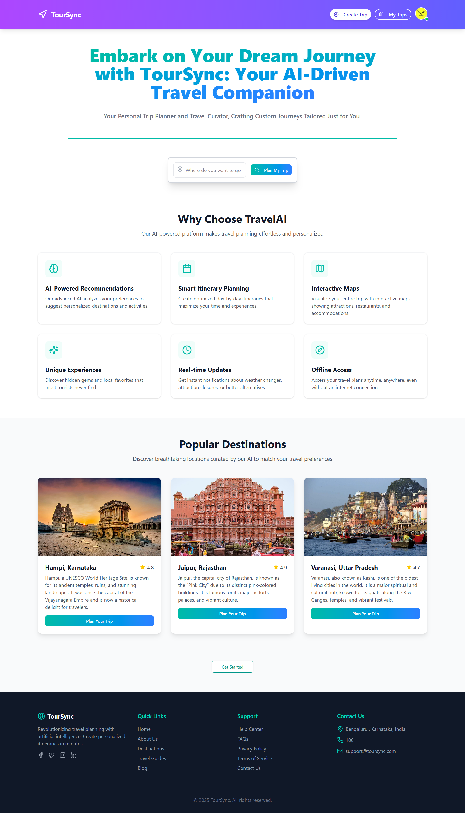
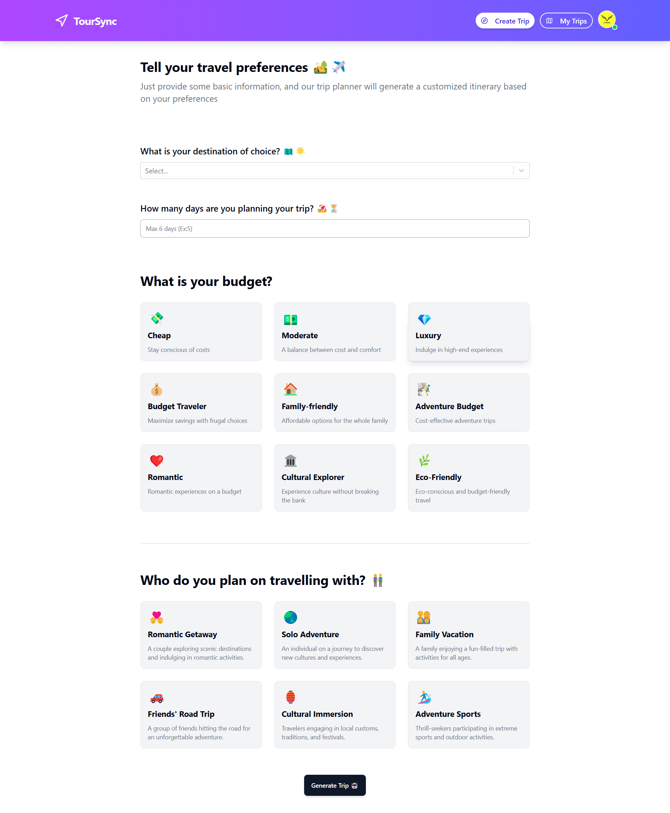
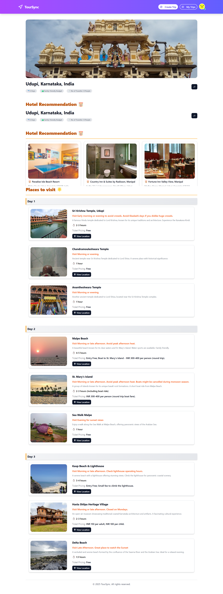
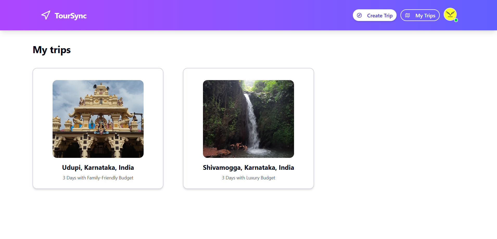

# AI-Powered Web Trip Planner

## [Live Demo](https://tour-sync.vercel.app/)

## Table of Contents

- Features
- Technologies Used
- Usage
- File Structure
- Screenshots
- Contributing

## Features

- **Landing Page with Form**: Allows users to input trip details like destination, duration, budget, and companions.
- **Google Places Autocomplete API**: Enhances user experience by suggesting locations as users type their destination.
- **Google Authentication**: Users can securely log in with their Google account for personalized trip recommendations.
- **AI-Powered Recommendations**: Personalized trip plans including hotel suggestions, places to visit, and a daily itinerary, generated by GPT-3.
- **Firebase Firestore Storage**: Stores trip data in Firestore, enabling users to view and manage their trip plans.
- **Tailwind CSS Styling**: Provides a responsive and modern design.
- **Vercel Deployment**: Fully deployable web application with easy access for users from anywhere.

## Technologies Used

- **React**: JavaScript library for building user interfaces.
- **Vite**: Build tool for faster and optimized development.
- **Tailwind CSS**: Utility-first CSS framework for responsive and customizable design.
- **Shaden UI**: UI component library used for the application.
- **Firebase**: Used for data storage in Firestore and authentication.
- **React Router Dom**: For managing routing and navigation between pages.
- **React Google Login**: Integration for Google Authentication.
- **GPT-3 API**: Powers AI-generated personalized trip recommendations.
- **Google Places API**: Provides location search and destination details.
- **Google Places Photo API**: Displays real images of selected destinations.

## Usage

### How to Use

1. **Clone the repository**:
    ```bash
    git clone https://github.com/sohan10012/TourSync.git
    ```

2. **Navigate to the project directory**:
    ```bash
    cd TourSync
    ```

3. **Install dependencies**:
    ```bash
    npm install
    ```

4. **Set up environment variables**:
    - Create a `.env` file and add your Google API keys, Firebase credentials, and GPT-3 API key.

    ```bash
    REACT_APP_GOOGLE_API_KEY=your-google-api-key
    REACT_APP_FIREBASE_API_KEY=your-firebase-api-key
    REACT_APP_GPT3_API_KEY=your-gpt3-api-key
    ```

5. **Start the development server**:
    ```bash
    npm run dev
    ```

6. **Open the application** in your browser at `http://localhost:3000`.

7. **Sign in** with your Google account to access personalized features and start planning your trip.

## File Structure

- `public/`: Contains static assets like images and icons.
- `src/`: Contains the main React application code.
  - `components/`: Reusable components such as the Header, Form, and Recommendations.
  - `pages/`: Application pages like the landing page and trip details page.
  - `firebase.js`: Firebase configuration and authentication setup.
  - `App.js`: Main component that includes routing and application logic.
- `.env`: Contains sensitive API keys and environment variables.

## Screenshots






## Contributing

If you would like to contribute to this project, please fork the repository and submit a pull request. For major changes, please open an issue first to discuss what you would like to change.
